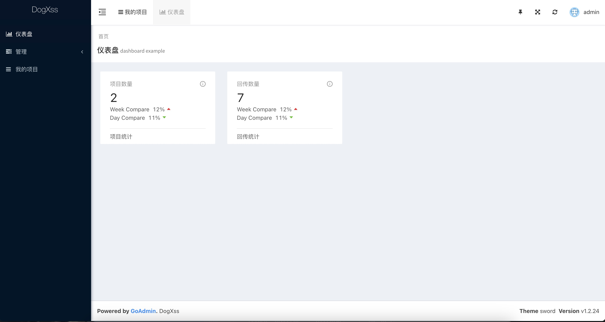
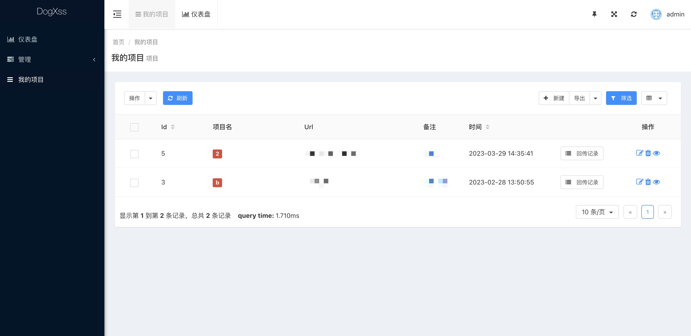
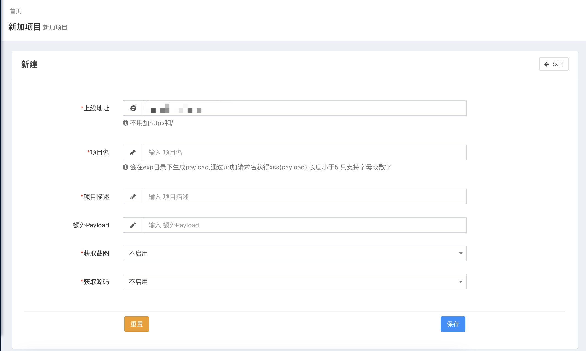
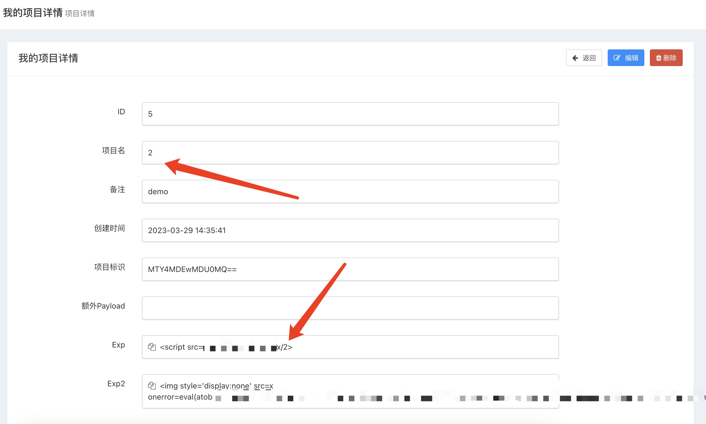
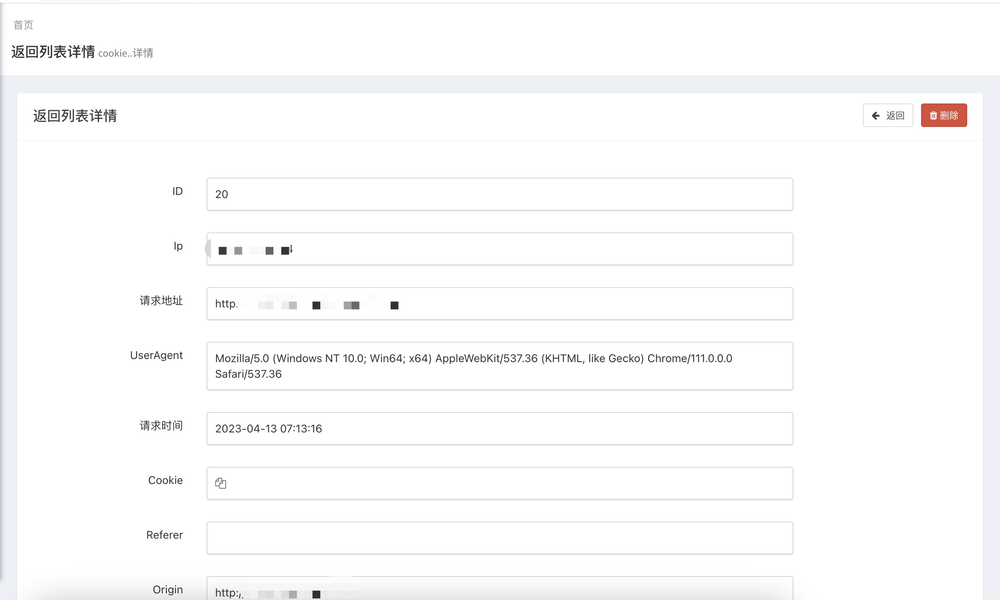

# DogXss(Ezxss-Golang)
**由于ezxss不能进行项目分组,也不会php,就用go花费一天时间仓促写完。**

**bug满多,勉强可以使用(加了xss过滤，但是没有大量测试过)**
.
---
**基于GoAdmin开发和ezxss payload完成**
ezxss的js支持截图,源码获取,SessionStorage等功能

ps:支持一键快速启动,必须使用https,需要指定ssl私钥证书

登录页面:https://yourdomain/admin/fucklogin

默认账号:admin
默认密码:123456  
请及时修改.
---

## 使用说明
```shell
dogxss -d www.baidu.com -key ssl.key -pem ssl.pem

指定域名和证书即可,默认绑定的是80和445端口,可按照自己的需求进行二开.
exp的地址默认前缀是x,如生成的项目名是a,那么exp地址就是www.baidu.com/x/a
可以自己在config/config.go中修改前缀.

需要测试的话，直接下载windows的版本.
然后执行dogxss.exe -d 127.0.0.1运行即可。
如果不使用ssl的话,那么https的站点就无法执行js.
```
## 编译命令
```shell
Windows:
go build -o dogxss.exe -ldflags "-w -s" --trimpath main.go
Linux(由于sqlite库的问题,需在linux主机上编译):
go build -o dogxss -ldflags "-w -s" --trimpath main.go
ps:编译完成后请在当前目录下建立exp目录
```
## 一些截图
主页

项目列表

新建项目

payload详细

返回详细

## TODO
1.Tg通知或其他通知

2.自动KeepSession

3.ip黑名单,域名黑名单

4.UI兼容

5.权限控制,不同用户对应不同项目

6.图片探针
## 已完成
1.兼容http和https

2.自动生成ezxss的payload

3.项目分组

## 更新日志
2023.03.04 修复若干bug

## 关于
时间：2023.03.01
博客: www.nctry.com
